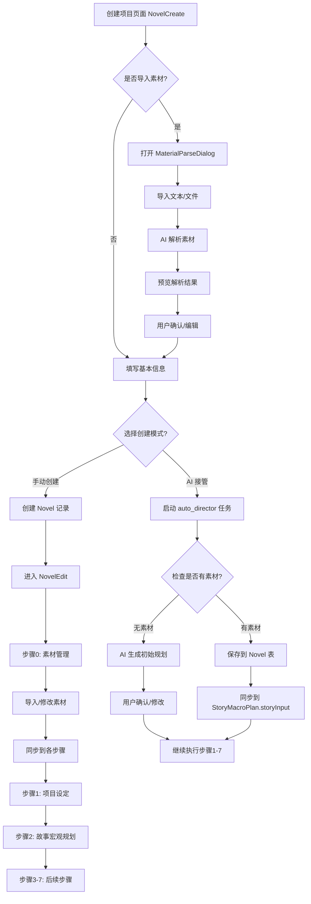
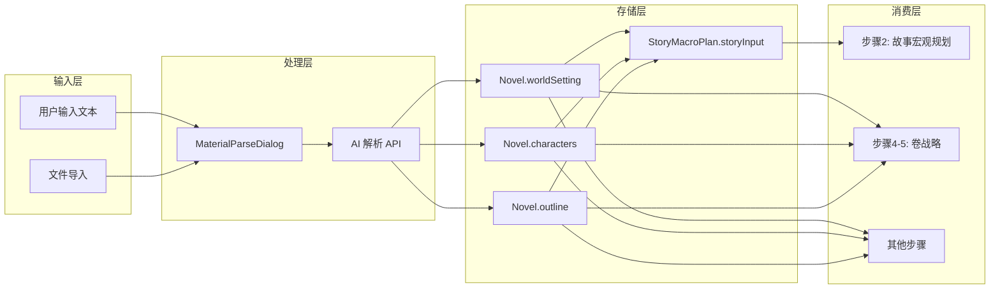
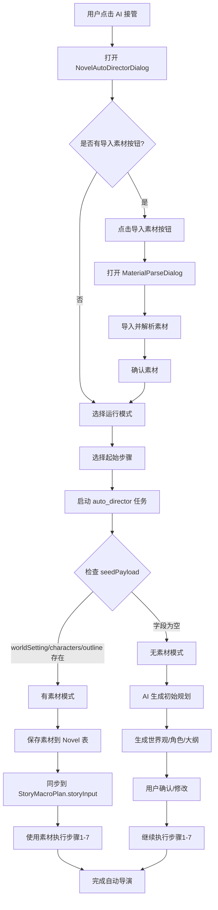
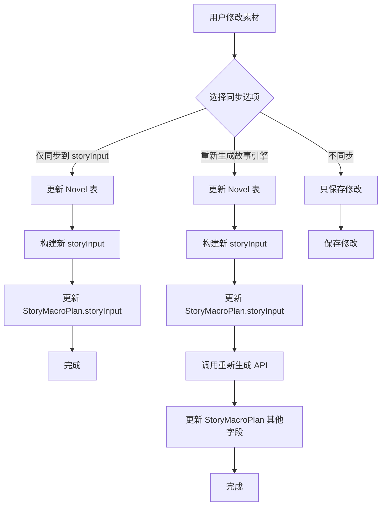
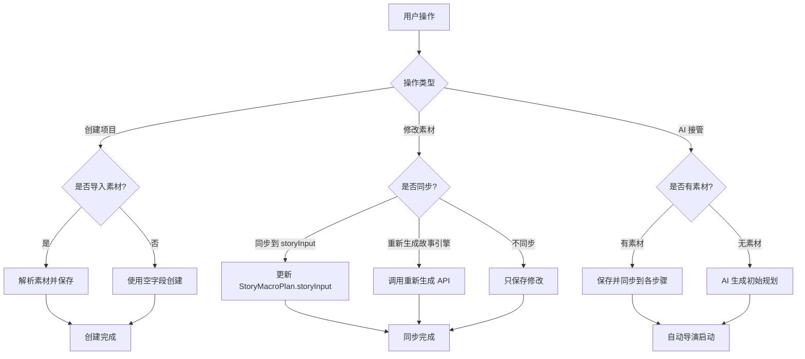
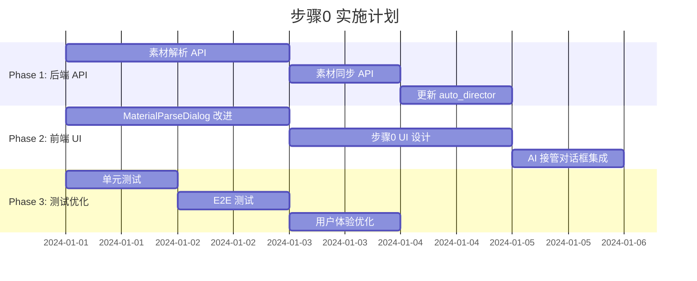

# 步骤0（素材导入）架构设计 - Mermaid 流程图

## 整体用户流程



## 素材数据流向图



## AI 接管模式流程



## 素材同步机制流程



## 数据库表关系图

```mermaid
erDiagram
    NOVEL {
        string id PK
        string title
        string description
        string worldSetting "世界观设定"
        string characters "角色信息"
        string outline "故事大纲"
    }
    
    STORY_MACRO_PLAN {
        string id PK
        string novelId FK
        string storyInput "故事想法输入"
        jsonb expansion "展开前提"
        jsonb decomposition "分解"
        jsonb constraints "约束"
    }
    
    VOLUME_PLAN {
        string id PK
        string novelId FK
    }
    
    CHAPTER {
        string id PK
        string novelId FK
        string volumeId FK
    }
    
    NOVEL ||--o{ STORY_MACRO_PLAN : "1:1"
    NOVEL ||--o{ VOLUME_PLAN : "1:N"
    NOVEL ||--o{ CHAPTER : "1:N"
    
    NOVEL {
        worldSetting: "从 MaterialParseDialog 导入"
        characters: "从 MaterialParseDialog 导入"
        outline: "从 MaterialParseDialog 导入"
    }
    
    STORY_MACRO_PLAN {
        storyInput: "自动从 worldSetting+characters+outline 构建"
    }
```

## 关键决策流程图



## 实施阶段流程图


